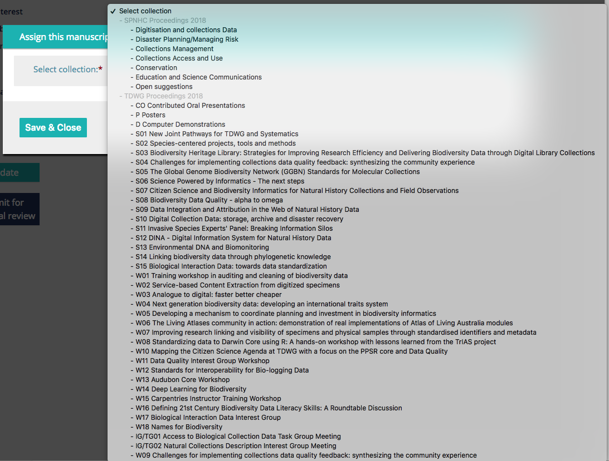
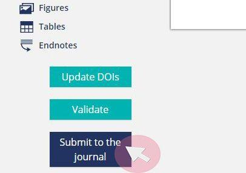

---
title: Instructions for Authors
layout: default
---  

# Instructions for Abstract Submission  

1) **Log in** or register at [https://biss.pensoft.net/](https://biss.pensoft.net/)  

2) **If you are starting a new abstract**, click the "Start SPNHC+TDWG 2018 Conference Abstract" button. Clicking this button takes you to the ARPHA writing tool and creates a *new* Untitled abstract with some of the author metadata you used to create your account.  

3) **If you have already started an abstract** and are coming back to work on it, log in to ARPHA directly from [https://arpha.pensoft.net](https://arpha.pensoft.net). After logging in you will see the titles of "My recent manuscripts." Click on your manuscript title, or click on "See More" to go to your dashboard [https://arpha.pensoft.net/dashboard.php](https://arpha.pensoft.net/dashboard.php) of all manuscripts on which you are listed as an author, their status, and revision history. If you accidentally create more than one abstract, you can delete it here. You can also start new abstracts here, but you will need to specify the journal (BISS) and the manuscript type (conference abstract).  

4) Click "Collections" on the top navigation bar of your manuscript (top right of figure below). This is where you find the conference (SPNHC or TDWG 2018) and subcollection (includes topics for SPNHC and list of symposia, workshops, and other contributions for TDWG) to which you are submitting your abstract. This step is critical as your abstract cannot be directed to the proper editors without a collection/subcollection designation. 

  

   a. If you are an invited speaker for a symposium or workshop in TDWG, select it from the options in the list.  
   b. If you are submitting an oral presentation for consideration by a symposium or workshop that is open to submissions (see [list](https://tdwg.github.io/conferences/2018/sessions/index) and check whether the one you are interested in will accept unsolicited contributions), select it from the options in the list. Note that this does not guarantee that your submission will be accepted by the organizers.  
   c. If you find you have selected the wrong (sub)collection or need to change it, the button to do so may have disappeared, replaced by "Collection: "XXX Yyyyy"" Use the email icon in the top navigation bar to contact Dr Editorial Secretary of your need to change collections.
   d. If you would like to deliver an oral presentation but none of the symposia or workshops match your topic, choose "Contributed Oral Presentations". You can also select "Posters" or "Computer demonstrations".  
   
  

5) Next, fill in your abstract's metadata from the list at the left by hovering over a category, and then clicking on the pencil icon.  
   a. The only mandatory fields are "Title", "Abstract", "Keywords", and "Presenting Author".  
   b. Titles should have all major words begin with a capital letter; please do not use all uppercase in your title.  
   c. The submitting author and affiliation are taken from the profile of the logged-in user.  
   d. More authors can be added by clicking the icon beside "Authors" in the left-side navigation panel. Be sure to add affiliations for all authors.  
   e. The corresponding author and the ordering of authors can be changed from the same menu. The corresponding author must be available to communicate about the abstract until final acceptance for publication. The presenting author is the person who will be delivering the talk/demonstration at the SPNHC or TDWG meeting.  
   f. The presenting author must register and attend the meeting.  

6) Submissions are limited to 600 words written in English and must address the [conference themes](http://spnhc-tdwg2018.nz/) or other topics in biodiversity informatics. Note that this is not a venue for reporting the results of research in your discipline.  
   a. Please write for a general audience with no unexplained jargon.  
   b. The first mention of acronyms or abbreviations in the abstract or figure/table legends must be spelled out (exceptions include GIS, HTML, TDWG, WWW, URL, XML, JPG, TIF, TIFF, PDF).  
   c. If you include references, create the reference list first before linking it to your text (see [https://arpha.pensoft.net/tips/Cite-references](https://arpha.pensoft.net/tips/Cite-references))
   d. Please proofread your submission carefully.  

7) You may add references (not included in word count), one figure, and one table by clicking on the appropriate icon. You may also upload supplementary materials associated with the abstract.  

8) Click "Validate." This will ensure that mandatory fields are filled in and the abstract is assigned to a collection. Be sure to finish this step, even if you and your co-authors are not finished writing or reviewing your submission.

9) When you are ready to submit your abstract, click "Submit for Technical Review." This will send the manuscript to the organizers of your session, who will review it for relevance. You will receive a confirmation email and the status of the manuscript will say "in pre-submission review." **The deadline for completing this step is 12 March 2018**.  

10) The organizers may accept or reject your submission, or may send feedback requesting changes, or suggest submission to a different session. Note that if a submission is returned to you for changes, its status will return to Draft. Only authors will have access to the abstract until you make changes, and redo steps 8 and 9. This may require more than one cycle of revision. 

11) **Once the abstract is accepted**, the 'Submit to the journal' button becomes visible in the ARPHA Writing Tool. You need to click this button and go through a checklist of submission steps. 

   a. The fourth and final step asks you to assign categories to your submission; this step is optional. 

   b. When the submission process is finalised, the abstract goes directly to production and publication, a DOI is assigned, and the abstract cannot be revised further. 

   c. The deadline for publication will be announced after the close of abstract submissions, to enable us to prepare the program

12) If at any time you need further assistance, check this [Tips and tricks](https://arpha.pensoft.net/tips/) link or if you fail to find an answer to your question, send an email to the journal's technical staff via the system. Click "Helpdesk" on the top navigation bar to open a new window with an email form for you to fill in.

### **ARPHA-related FAQs**

**What is a collection? What is a collection editor?**

Pensoft allows articles to be grouped into "collections" (typically around a theme). The TDWG 2018 proceedings is a collection as is SPNHC 2018, and every workshop and symposium is a sub-collection. You are a collection editor if you are the primary contact (and sometimes those listed as "contributors") for your workshop/symposium. 

**How does the editing process work?**

Please refer to the [instructions for editors](https://tdwg.github.io/conferences/2018/instructions-for-editors/).

**Where do I enter the state or province under address as an author?**

ARPHA does not currently track that information.

**How do I know the status of my abstract?**

Sign into [ARPHA](https://arpha.pensoft.net/). Your abstract(s) should be listed under the My Manuscripts tab (text will be gray) on your dashboard. On the right of each manuscript, you can see the status. Note that only one person can work on an abstract at a time. If you are not actively working on a manuscript, please close the window to give others a chance to contribute.

* **Draft** = authors have editing rights; editors see as read-only; authors must submit the abstract for review for the abstract to be released for editorial assessment.*

* **In pre-submission review** = authors see as read-only; editors are able to make changes to the abstract and add comments. Authors may see these updates but will not be able to make changes until editors release the abstract back to the authors using the Send Feedback button. Pressing the Send Feedback button returns the abstract to **Draft** mode so that authors may respond.*

* Once your abstract has been **Approved** it will go through various stages to be **Published**. The submitting author will then have one final publication checklist to complete. See published abstracts [https://biss.pensoft.net/collection/25/](https://biss.pensoft.net/collection/25/) from 2017.

*both authors and editors can send email (see icon near the top of the page) to co-authors and/or editors at any time during the pre-approval process, *this does not change the status of the manuscript.*

**What if I don't see my abstract anywhere?**

It is possible that you have more than one ARPHA account under different emails. Please consolidate them if this is the case. Otherwise, communicate with the help desk to try to resolve technical issues or with conference organizers for content/meeting-related questions.

